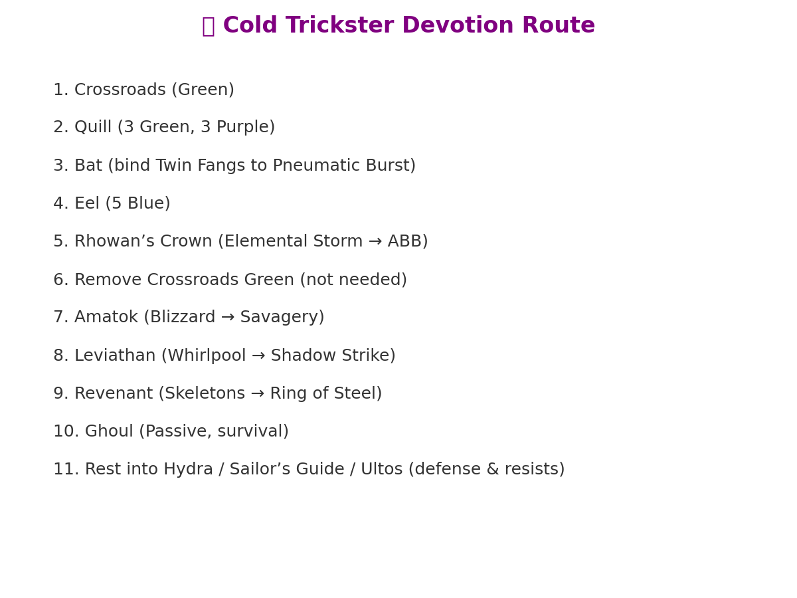

# ❄️ Cold Trickster Build Guide (Nightblade + Shaman)

_A full leveling & endgame guide for Grim Dawn with all DLCs, optimized for campaign and superbosses._

---

## 📌 Build Idea
- Dual Wield Cold Damage (Nightblade + Shaman)
- Leveling with **Amarasta’s Blade Burst (ABB)** + **Shadow Strike**
- Transition into **Savagery Auto-Attacks** for Endgame
- Tanky with **Heart of the Wild, Oak Skin, Shadow Dance**
- High Sustain via **Pneumatic Burst** + **Devotion Leech**

---

## ✅ Pros & Cons
**✔ Pros**
- Very safe leveling (heal, dodge, lifesteal)
- Extremely high single target DPS (Execution + Savagery)
- Easy devotion scaling with Blizzard, Whirlpool, Elemental Storm
- Can farm superbosses (Lokarr, Ravager, Mogdrogen) with proper gear

**✖ Cons**
- Gear dependent at level 94+ for full potential
- Needs good keybind setup
- Slightly slower than Infiltrator in Crucible/SR

---

## 📊 Attributes
- **Physique**: ~80–85% (for armor & DA)  
- **Cunning**: just enough for weapons  
- **Spirit**: only if gear requires  

---

## 🪓 Skill Trees

### Nightblade + Shaman (Level 100 Final Setup)

---

## 🌌 Devotions

### Step-by-Step Route

- **Bat** → bind *Twin Fangs* to **Pneumatic Burst**  
- **Rhowan’s Crown** → bind *Elemental Storm* to **ABB**  
- **Amatok** → bind *Blizzard* to **Savagery**  
- **Leviathan** → bind *Whirlpool* to **Shadow Strike**  
- **Revenant** → bind Skeletons to **Ring of Steel**  
- **Ghoul** → passive survival proc  

---

## 🛡️ Gear

### Leveling Gear
- **Weapons**: Any Cold Damage dagger/sword.  
  - Farm: *Chillstrife* (Ugdenbog Gloomweaver)  
  - Components: Chilled Steel, later Coldstone  
- **Relic**: Mistborn Talisman → later Guile  
- **Armor**: anything with +resistances  

### Endgame Gear (Best-in-Slot)
- **Set**: Deathmarked (Nightblade Cold Set)  
- **Weapons**: Crescent Moon / Cold Chillstrife  
- **Amulet**: Night’s Embrace  
- **Rings**: Alkamos’ Rings (Steps of Torment)  
- **Relic**: Nemesis  

---

## 🎮 Keybinds (German Keyboard + Mouse)

- **LMB**: Savagery (later) / Default Attack (early)  
- **RMB**: Shadow Strike (mobility, Whirlpool)  
- **Mousewheel Down**: ABB (AoE + Elemental Storm)  
- **Mousewheel Up**: Pneumatic Burst (heal + Twin Fangs)  
- **Mousewheel Click**: Blade Barrier (panic button)  
- **1**: Ring of Steel (skeletons from Revenant)  
- **2**: Movement Rune (teleport/leap)  
- **3**: Mogdrogen’s Pact (toggle once)  
- **Q**: Health Potion  
- **R**: Energy Potion  

---

## 🐉 Boss Strategy
- **ABB + Elemental Storm** first (reduce resistances)  
- **Shadow Strike in → Whirlpool drop → ABB → back out**  
- Spam **Savagery chain** for DPS  
- Use **Pneumatic Burst** off cooldown  
- **Blade Barrier** when low HP  
- For superbosses: kite with Shadow Strike + ABB  

---

## 🔄 Respec Notes
- Early game ABB = main damage  
- Mid game (40–50): respec ABB down, focus on Savagery + WPS  
- Endgame (100): ABB only as utility (Elemental Storm trigger), Savagery = main attack  

---

# 🎯 Summary
- Level with ABB + Shadow Strike until ~40  
- Transition into Savagery auto-attacker  
- Use Night’s Chill + Rhowan’s Crown
